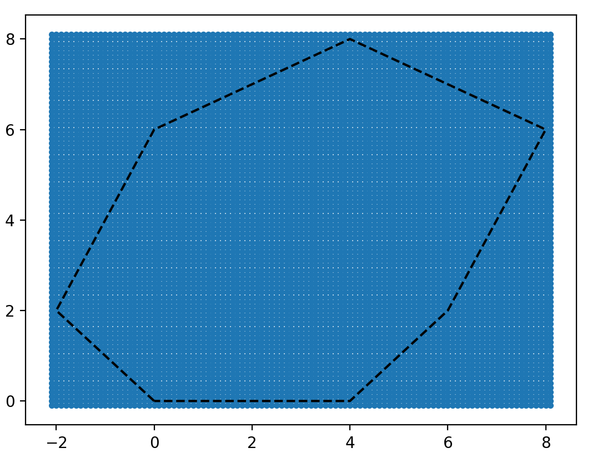
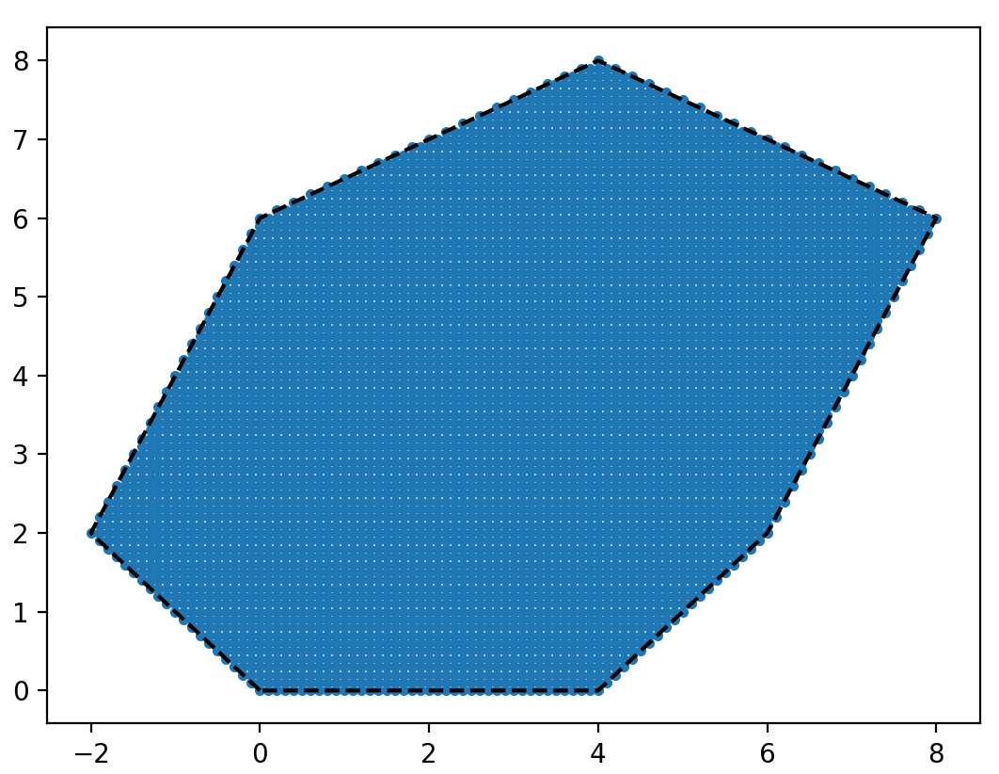
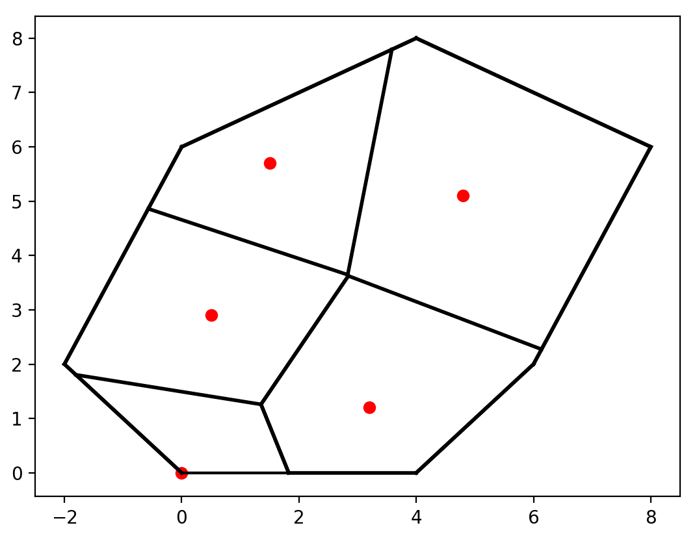
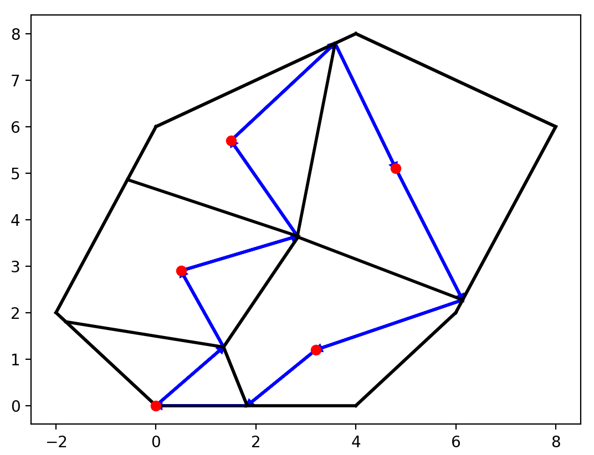
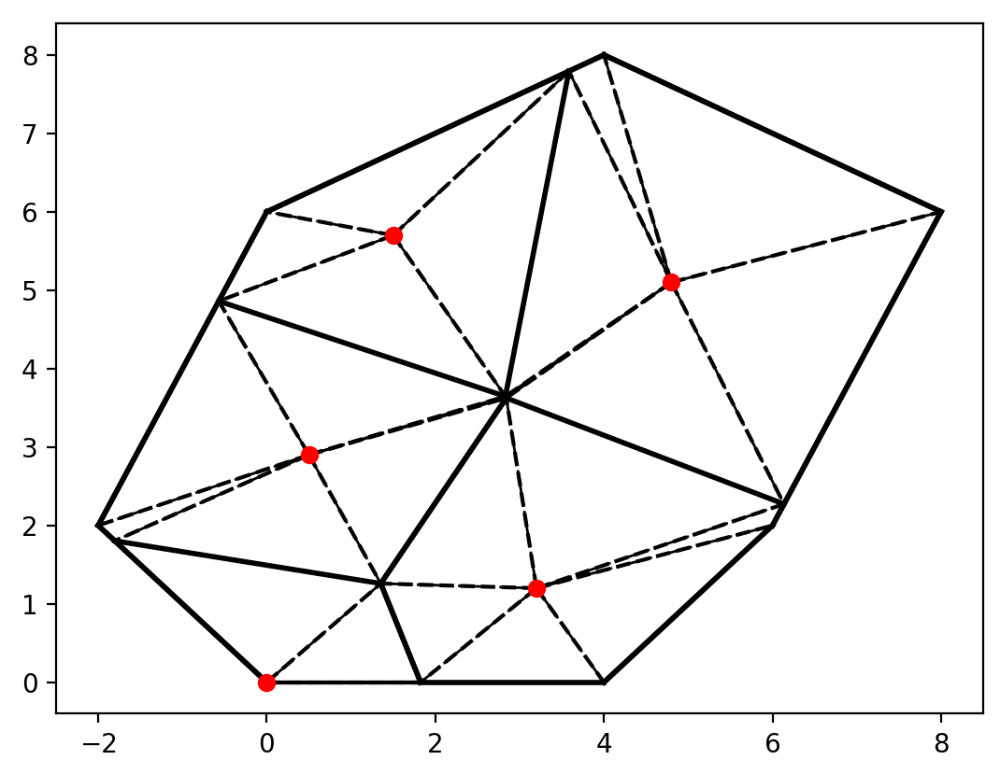
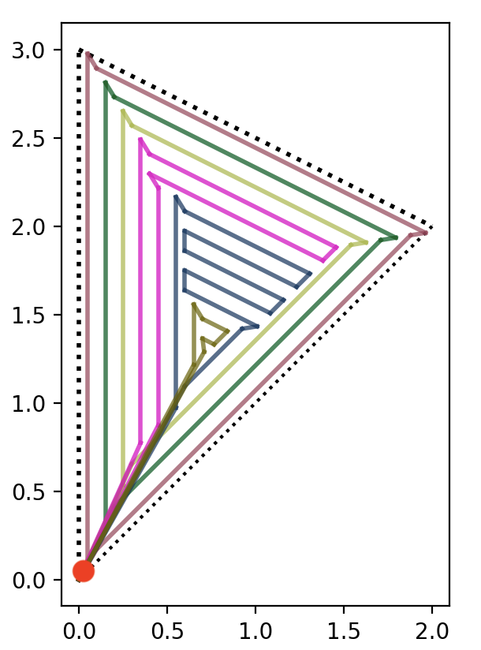
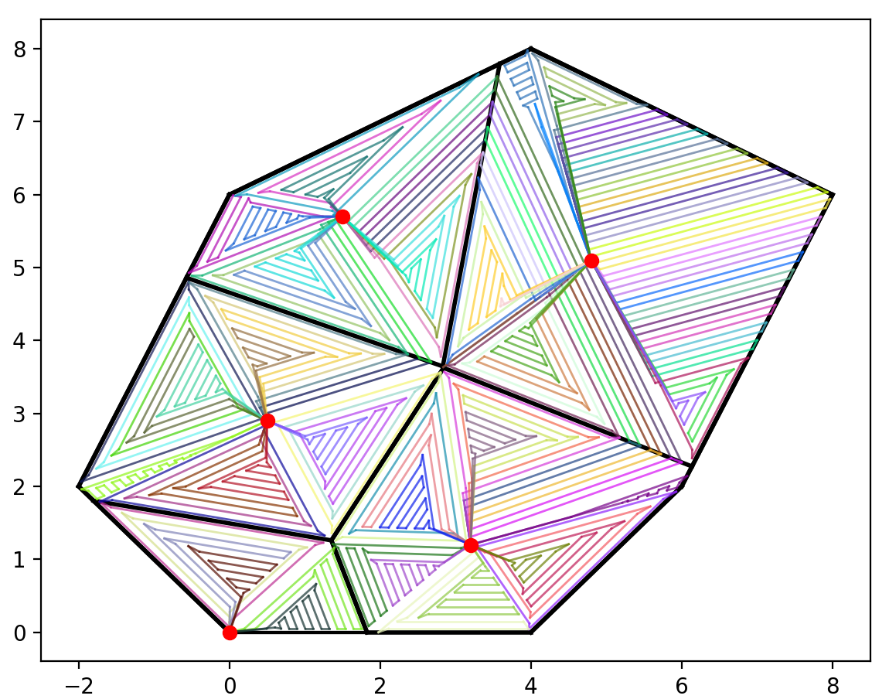

# Optimal Drone Field Coverage

## Required Packages 
- Numpy
- Scipy
- Matplot
- Shapely
- Cvxopt

 
## Program Operation

### Mask of Field [(Source)](Main/Field.py)
- First, a large set of 'dots' are created in a grid that captures the region. 

- Then, we use matplotlib.Path to create the mask of the figure. The 'dots' that remain, are the coordinates that are inside the region.

### Optimal Charging Station Location [(Source)](Main/minCharge.py)
- We use a linear program that finds the optimal locations to place the charging stations such that it minimizes the mission time of the drone per Charging Station (CS) coverage region.

### Voronoi Regions [(Source)](Main/Field.py)
- We create Voronoi regions to specify what region the drone will be covering per CS location.

### Walk [(Source)](Main/Tourfn2.py)
- We use a linear program to minimize the edges used to traverse the CS.

### Triangularization [(Source)](Main/Field.py)
- We triangulate each Voronoi region to apply the drone mission algorithm.

### Drone mission algorithm [(Source)](Main/DronePath2.py)

- Here, we show the path the drone takes in a triangular region. Each color represents a new cycle after each recharge.

### Run [(Source)](Main/Run.py)
- This is the final product when putting the submodules together.

