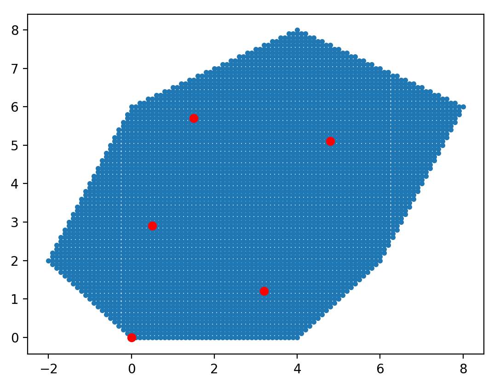

# Optimal Drone Field Coverage

## Required Packages 
- Numpy
- Scipy
- Matplot
- Shapely
- Cvxopt

 
## Program Operation

### Mask of Field [(Source)](Main/Field.py)

### Optimal Charging Station Location [(Source)](Main/minCharge.py)

### Voronoi Regions [(Source)](Main/Field.py)

### Walk [(Source)](Main/Tourfn2.py)

### Triangulation [(Source)](Main/Field.py)

### Drone Path 
[(Source)](Main/DronePath2.py)

### Run [(Source)](Main/Run.py)

Combines all these submodules into a single program.

